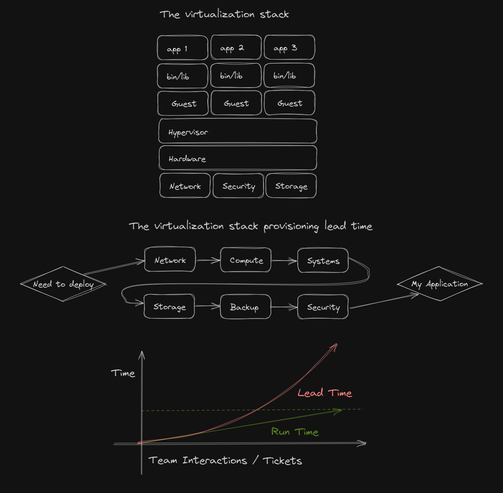
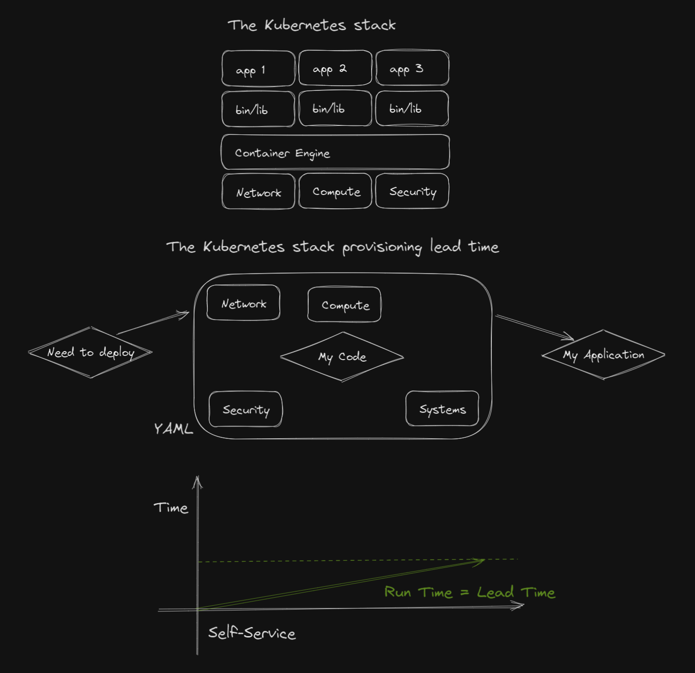
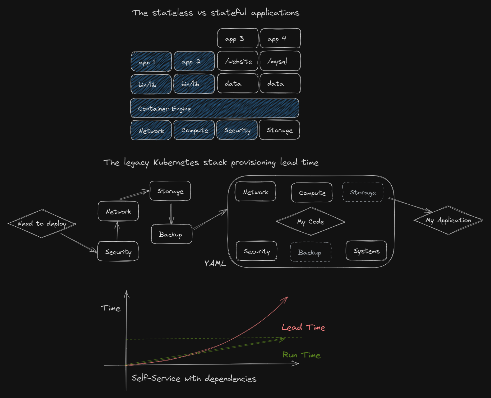
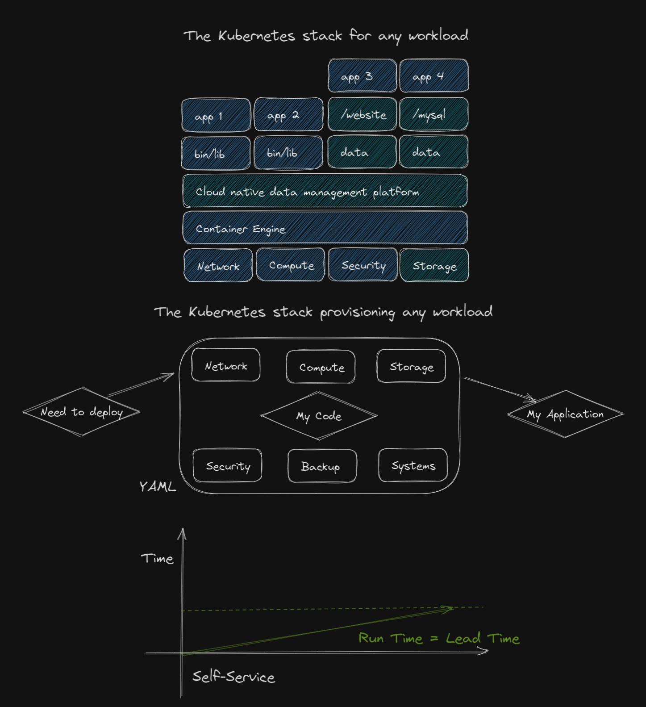

## DeveloperWeek Global Cloud 2021 Conference 

This repository provides the content of an OPEN TALK held at the DeveloperWeek Global Cloud 2021 about *How to solve Kubernetes persistent storage at scale and speed the GitOps way*. 

Persistent storage is one of the most difficult challenges to solve for Kubernetes workloads especially when integrating with continuous deployment solutions. The session will provide the audience with an overview of how to address persistent storage for stateful workload the Kubernetes way and how to operationalize with a common CD practice like GitOps.

The content is for educational purposes, is linked to field experience, and, for the demo, tested on Google Cloud. The content can be reused freely as-is. StorageOS Customer Success is available to provide the audience with the supporting experience in such journey.

## Intro
The last two decades of IT innovations have been addressing the consumption of resources; from an usage and cost efficiency up.  
However, even with the introduction of Agile and DevOps practices leading to an organized, scalable, and systemic automation, the speed of deployment within large enterprise did not improve due to the heavily siloed IT department. 
The below graph presents the actual run time for all related tasks to accomplish versus the lead time which includes the run time AND the SLA driven organization in which multiple team will pass the "ball". This curve is an exponentially increasing with additional third parties like managed services.   



## Kubernetes
Large software companies with the need of a fast go-to-market had to change their models to guarantee fast development and release cycles.  
With the need of companies like Google, a new approach to efficiency was taken wihtin the form of Kubernetes.  
Why is it different?  
Virtualization stack provisions every components as isolated ones in a serialized way, most likely reflecting the organizational structure and processes of the IT department.  
The major shift here is to: 
- enforce a defacto Infrastructure-as-Code approach defining a desired state for every components 
- enforce a software-define approach allowing to reduce the manual or semi-automated actions to configure hardware components 
- provide a full abstraction layer through the usage of an API driven solution to deal with any components including deploying applications 

When an Application Team has to deploy an application, in any of the DTAP stages, there is no need to create a dozen tickets to a dozen or more teams. Instead, the actual application needs is detailed as a desired state within a YAML file which will be submitted and processed by Kubernetes.  
The run time can become the lead time!



## Stateful applications 
There is a massive secret to be shared regarding Kubernetes; it is designed to run stateless workload or, in other words, applications that don't need persistence of data.  
Kubernetes is an orchestrator for containers and these are based on read-only container images. Any data generated during the run time of the container will be in memory. Once the workload is stop or even rescheduled on a different node, that data will be lost.  
Kubernetes is not a storage orchestrator like it is not a network orchestrator, it relies on software-defined components to handle such requirements.  

Not having such software-defined components to handle the storage part will result in having a hybrid operational model calling for tickets handling for attaching storage to the Kubernetes nodes generating a wait time to associated with the run time as shown with the next graph.



## Stateless/Stateful who cares?
To this shoking question and considering the Kubernetes abstration framework, no one should care!  
By introducing a cloud native software-defined data management layer, the Application Team can self-service themselve again to build and deploy at speed and scale.  
Like for a stateless application, the overall deployment manifest will contain the desired state for all the required components that the application will be using including elements like storage and backup.  
This allows to reduce the day 1 and day 2 operation burden for both the Infrastructure and Application team.  



## We all agree, we don't care!
Alright, but some management folks might from a separation of duties, four eyes principle and all the security requirements for a healthy IT department serving the business.   

### Infrastructure Team
Our Infrastructure/Platform colleagues who knowns about that storage stuff will create for the Application Teams Kubernetes StorageClass which represents level of services:
- [storage-for-dev-and-test](#storage-for-dev-and-test); no replication, no encryption, no compression - the bare minimum to support the Developers to work on a stateful application.
- [storage-for-acceptance](#storage-for-acceptance); 1 replica, no encryption, no compression - required to validate the application behaviour when there are failures/partitioning. 
- [storage-for-production](#storage-for-production); 2 replicas, encryption, no compression - to guarantee the high availability of the data and its safety. 

These StorageClass should be stored in a Git repository to track changes and allow a GitOps approach to synchronize and track any drift from a Kubernetes side.   
Note: StorageClass is a special Kubernetes API object that can't be edit/updated when deployed. It needs to be deleted and then sync back.  

Here is how it translates from a YAML definition perspective:  

#### [storage-for-dev-and-test](demo/storageclass/storage-for-dev-and-test.yaml)
```YAML
---
apiVersion: storage.k8s.io/v1
kind: StorageClass
metadata:
  name: storage-for-dev-and-test
provisioner: csi.storageos.com
allowVolumeExpansion: true
parameters:
  fsType: ext4
  pool: default
-snip-
```

#### [storage-for-acceptance](demo/storageclass/storage-for-acceptance.yaml)
```YAML
---
apiVersion: storage.k8s.io/v1
kind: StorageClass
metadata:
  name: storage-for-acceptance
provisioner: csi.storageos.com
allowVolumeExpansion: true
parameters:
  fsType: ext4
  pool: default
  storageos.com/replicas: "1"
-snip-
```

#### [storage-for-production](demo/storageclass/storage-for-acceptance.yaml)
```YAML
---
apiVersion: storage.k8s.io/v1
kind: StorageClass
metadata:
  name: storage-for-production
provisioner: csi.storageos.com
allowVolumeExpansion: true
parameters:
  fsType: ext4
  pool: default
  storageos.com/replicas: "2"
  storageos.com/encryption: "true"
-snip-
```

### Application Team
The only requirement is to use a StatefulSet deployment type for the application when deploying a stateful application, the definition is available here ["StatefulSet"](https://kubernetes.io/docs/concepts/workloads/controllers/statefulset/) (and more [here](https://cloud.google.com/kubernetes-engine/docs/how-to/stateful-apps)).  
Using such deployment type tells Kubernetes orchestrator to:
- be gentle! It's not a stateless application, there is precious data that we want to keep. 
- respect the order! With stateful workload, order is required for deploying, scaling and updating the application  

Here is an example of a StatefulSet for a PostgreSQL database available with the *demo* directory of this repository: 

```YAML
---
apiVersion: v1
kind: Service
metadata:
  name: foodmag-app-db-service
  namespace: stateful-app-dev
  labels:
    app: foodmag-app-db
    env: dev
spec:
  type: ClusterIP
  ports:
   - port: 5432
  selector:
    app: foodmag-app-db
    env: dev
---
apiVersion: apps/v1
kind: StatefulSet
metadata:
  name: foodmag-app-db
  namespace: stateful-app-dev
spec:
  selector:
    matchLabels:
      app: foodmag-app-db
      env: dev
  serviceName: foodmag-app-db-service
  replicas: 1
  template:
    metadata:
      annotations:
        backup.velero.io/backup-volumes: foodmag-app-db-pvc
      labels:
        app: foodmag-app-db
        env: dev
    spec:
      containers:
        - name: foodmag-app-db
          image: postgres:latest
          ports:
            - containerPort: 5432
              name: foodmag-app-db
          env:
            - name: POSTGRES_DB
              value: foodmagappdb
            - name: POSTGRES_USER
              value: foodmagapp
            - name: POSTGRES_PASSWORD
              value: foodmagpassword
            - name: PGDATA
              value: /var/lib/postgresql/data/pgdata
          volumeMounts:
            - name: foodmag-app-db-pvc
              mountPath: /var/lib/postgresql/data
  volumeClaimTemplates:
    - metadata:
        name: foodmag-app-db-pvc
        labels:
          app: foodmag-app-db
          env: dev
      spec:
        accessModes: ["ReadWriteOnce"]
        storageClassName: "storage-for-dev-and-test"
        resources:
          requests:
            storage: 10Gi
```

Here is another example of StatefulSet for an old school CMS called Drupal:

```YAML
---
apiVersion: v1
kind: Service
metadata:
  name: foodmag-app-fe-service
  namespace: stateful-app-dev
  labels:
    app: foodmag-app-fe
    env: dev
spec:
  type: NodePort
  ports:
   - port: 80
     nodePort: 30080
  selector:
    app: foodmag-app-fe
    env: dev
---
apiVersion: apps/v1
kind: StatefulSet
metadata:
  name: foodmag-app-fe
  namespace: stateful-app-dev
spec:
  selector:
    matchLabels:
      app: foodmag-app-fe
      env: dev
  serviceName: foodmag-app-fe-service
  replicas: 1
  template:
    metadata:
      annotations:
        backup.velero.io/backup-volumes: foodmag-app-fe-pvc            
      labels:
        app: foodmag-app-fe
        env: dev
    spec:
      initContainers:
        - name: fix-perms
          image: drupal:latest
          command: ['/bin/bash','-c']
          args: ['/bin/cp -R /var/www/html/sites/ /data/; chown -R www-data:www-data /data/']
          volumeMounts:
            - name: foodmag-app-fe-pvc
              mountPath: /data
      containers:
        - name: foodmag-app-fe
          image: drupal:latest
          ports:
            - containerPort: 30080
              name: foodmag-app-fe
          volumeMounts:
            - name: foodmag-app-fe-pvc
              mountPath: /var/www/html/modules
              subPath: modules
            - name: foodmag-app-fe-pvc
              mountPath: /var/www/html/profiles
              subPath: profiles
            - name: foodmag-app-fe-pvc
              mountPath: /var/www/html/themes
              subPath: themes
            - name: foodmag-app-fe-pvc
              mountPath: /var/www/html/sites
              subPath: sites
  volumeClaimTemplates:
    - metadata:
        name: foodmag-app-fe-pvc
        labels:
          app: foodmag-app-fe
          env: dev
      spec:
        accessModes: ["ReadWriteOnce"]
        storageClassName: "storage-for-dev-and-test"
        resources:
          requests:
            storage: 10Gi
```

## Demo time! 

Since the talk has recordings, the demo will be using YouTube videos in this order:

### Setting up the environment

This first video is helping to get the StorageOS layer in place as the software-defined storage component interacting with Kubernetes to provide a true cloud native data management layer.  
There is a free-tier for personal use and the deployment is agnostic of any Kubernetes flavors:  

Title: Demo 1/3: https://www.youtube.com/watch?v=dM7qmHEjiH8

### 